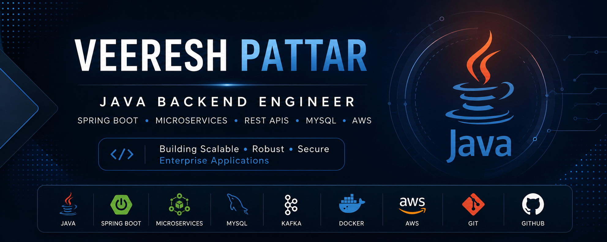

  

<h1 align="center">Hi 👋, I'm Veeresh Pattar</h1>

<h3 align="center">
Java Backend Engineer
</h3>

---

# 👨‍💻 About Me

- 💼 Java Backend Engineer with nearly **3 years of professional experience**
- 🚀 Passionate about building scalable backend systems using **Spring Boot** and **Microservices**
- 🔐 Experienced in **Spring Security, Hibernate/JPA, REST APIs, MySQL, and Angular**
- 📚 Currently exploring **Design Patterns, Low-Level Design (LLD), and System Design**
- 💡 I enjoy solving real-world business problems through clean architecture and maintainable code.

---

# 🛠 Tech Stack

---

# 🚀 Featured Projects

### 🛒 vpMART

Enterprise-style e-commerce application built using Spring Boot and Angular with secure authentication, product management, and responsive user experience.

---

### 📝 Online Examination Portal

Role-based examination platform supporting online assessments, user management, authentication, and result processing.

---

### ⚙️ Spring Boot Microservices

Learning project demonstrating scalable microservice architecture, API Gateway, and inter-service communication.

---

### 🔗 REST API Collection

Production-style REST APIs showcasing validation, exception handling, layered architecture, and best coding practices.

---

# 📈 GitHub Statistics

---

# 📄 Resume

📥 **[Download My Resume](./Veeresh_Pattar_Resume.pdf)**

---

# 📫 Contact

📧 **veereshpattar5027@gmail.com**

📍 **Bengaluru, Karnataka**

---

⭐ Thanks for visiting my GitHub profile!

